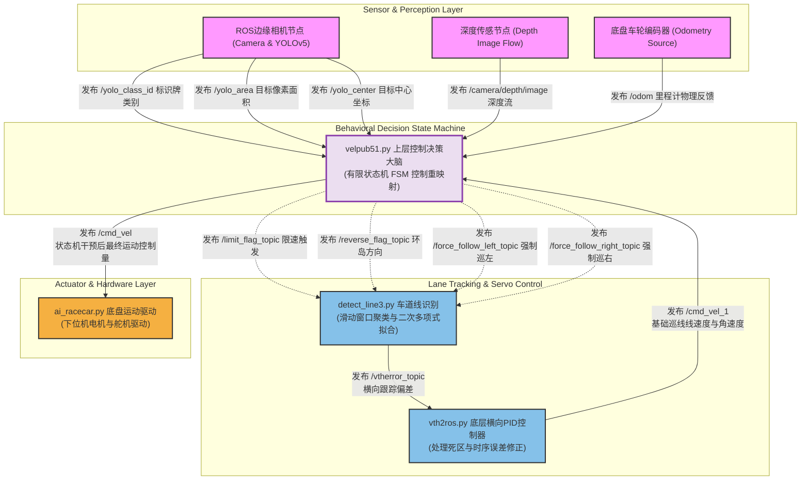

```mermaid
graph TB
    subgraph 1_感知层 [Sensor & Perception Layer]
        Sub_Cam_RGB["ROS边缘相机节点 (Camera & YOLOv5)"]
        Sub_Cam_Depth["深度传感节点 (Depth Image Flow)"]
        Sub_Odom["底盘车轮编码器 (Odometry Source)"]
    end

    subgraph 2_视觉伺服与底层控制 [Lane Tracking & Servo Control]
        Node_DetectLine["detect_line3.py 车道线识别<br/>(滑动窗口聚类与二次多项式拟合)"]
        Node_Vth2ros["vth2ros.py 底层横向PID控制器<br/>(处理死区与时序误差修正)"]
        
        Node_DetectLine -->|发布 /vtherror_topic<br/>横向跟踪偏差| Node_Vth2ros
    end

    subgraph 3_多源行为决策 [Behavioral Decision State Machine]
        Node_Velpub["velpub51.py 上层控制决策大脑<br/>(有限状态机 FSM 控制重映射)"]
    end

    subgraph 4_硬件执行层 [Actuator & Hardware Layer]
        Node_Base["ai_racecar.py 底盘运动驱动<br/>(下位机电机与舵机驱动)"]
    end

    %% 感知层流向决策层与伺服层
    Sub_Cam_RGB -->|发布 /yolo_class_id 标识牌类别| Node_Velpub
    Sub_Cam_RGB -->|发布 /yolo_area 目标像素面积| Node_Velpub
    Sub_Cam_RGB -->|发布 /yolo_center 目标中心坐标| Node_Velpub
    Sub_Cam_Depth -->|发布 /camera/depth/image 深度流| Node_Velpub
    Sub_Odom -->|发布 /odom 里程计物理反馈| Node_Velpub

    %% 核心速度重映射链路 (过渡话题 -> 决策覆盖 -> 最终话题)
    Node_Vth2ros -->|发布 /cmd_vel_1<br/>基础巡线线速度与角速度| Node_Velpub
    Node_Velpub -->|发布 /cmd_vel<br/>状态机干预后最终运动控制量| Node_Base

    %% 决策层反向调节视觉感知逻辑 (反向控制环)
    Node_Velpub -.->|发布 /limit_flag_topic 限速触发| Node_DetectLine
    Node_Velpub -.->|发布 /reverse_flag_topic 环岛方向| Node_DetectLine
    Node_Velpub -.->|发布 /force_follow_left_topic 强制巡左| Node_DetectLine
    Node_Velpub -.->|发布 /force_follow_right_topic 强制巡右| Node_DetectLine

    %% GitHub专用安全内联样式定义
    style Sub_Cam_RGB fill:#F9F,stroke:#333,stroke-width:2px;
    style Sub_Cam_Depth fill:#F9F,stroke:#333,stroke-width:2px;
    style Sub_Odom fill:#F9F,stroke:#333,stroke-width:2px;
    
    style Node_DetectLine fill:#85C1E9,stroke:#333,stroke-width:2px;
    style Node_Vth2ros fill:#85C1E9,stroke:#333,stroke-width:2px;
    
    style Node_Velpub fill:#EBDEF0,stroke:#8E44AD,stroke-width:3px;
    
    style Node_Base fill:#F5B041,stroke:#333,stroke-width:2px;
```
