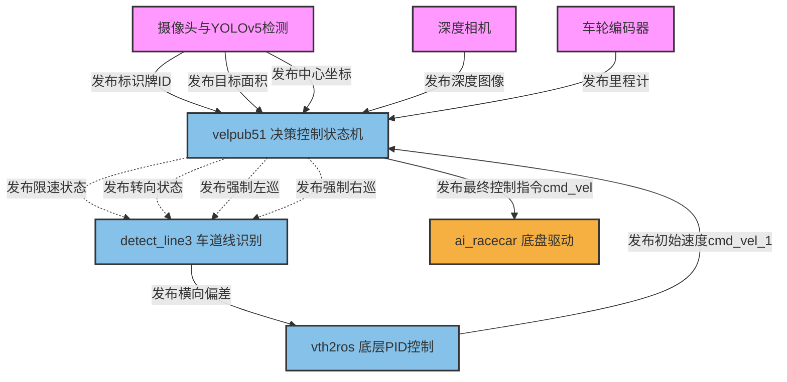

```markdown

```mermaid
graph TB
    Sub_Cam_RGB["摄像头与YOLOv5检测"]
    Sub_Cam_Depth["深度相机"]
    Sub_Odom["车轮编码器"]

    Node_DetectLine["detect_line3 车道线识别"]
    Node_Vth2ros["vth2ros 底层PID控制"]
    Node_Velpub["velpub51 决策控制状态机"]

    Node_Base["ai_racecar 底盘驱动"]

    Node_DetectLine -->|发布横向偏差| Node_Vth2ros

    Sub_Cam_RGB -->|发布标识牌ID| Node_Velpub
    Sub_Cam_RGB -->|发布目标面积| Node_Velpub
    Sub_Cam_RGB -->|发布中心坐标| Node_Velpub
    Sub_Cam_Depth -->|发布深度图像| Node_Velpub
    Sub_Odom -->|发布里程计| Node_Velpub

    Node_Vth2ros -->|发布初始速度cmd_vel_1| Node_Velpub
    Node_Velpub -->|发布最终控制指令cmd_vel| Node_Base

    Node_Velpub -.->|发布限速状态| Node_DetectLine
    Node_Velpub -.->|发布转向状态| Node_DetectLine
    Node_Velpub -.->|发布强制左巡| Node_DetectLine
    Node_Velpub -.->|发布强制右巡| Node_DetectLine

    style Sub_Cam_RGB fill:#F9F,stroke:#333,stroke-width:2px;
    style Sub_Cam_Depth fill:#F9F,stroke:#333,stroke-width:2px;
    style Sub_Odom fill:#F9F,stroke:#333,stroke-width:2px;
    style Node_DetectLine fill:#85C1E9,stroke:#333,stroke-width:2px;
    style Node_Vth2ros fill:#85C1E9,stroke:#333,stroke-width:2px;
    style Node_Velpub fill:#85C1E9,stroke:#333,stroke-width:2px;
    style Node_Base fill:#F5B041,stroke:#333,stroke-width:2px;
```
```
